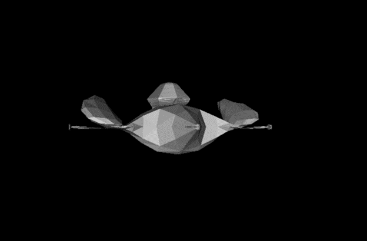

# SR-2-FlatShading

## Description
This is a program that renders using the SDL2 library to draw a 3D model but in this case it is colored in shades of gray according to a light source, in a window through the GLM library. The model is loaded into an OBJ file that is displayed on the screen using face triangulation, barycentric coordinates, flat shading, zbuffer and model, view  projection and viewport techniques.

This is the result of rendering my spaceship made in blender:




## Dependencies
- SLD2: Library used to create windows and render graphics.
- GLM: Mathematical Library for operations with vectors and matrices.

## Using Linux

First you need to install WSL, C++ with CMake, SDL and GLM

Then you need to run this command with the repository clone and in the folder SR-2-FLATSHADING

```shell
./run.sh
```

